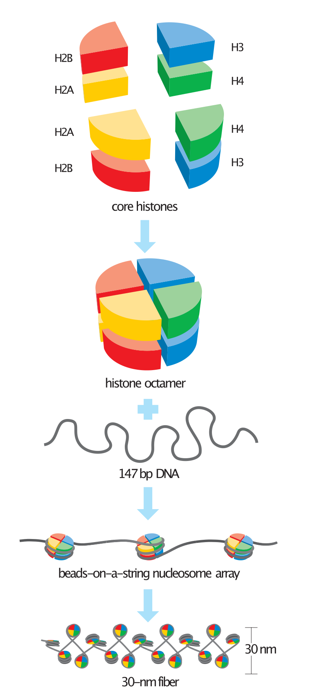

*This section keeps the notes of some terms I'm not familiar with.*

### *Cryptococcus deuterogattii*

Source: [Cryptococcus gattii - Wikipedia](https://en.wikipedia.org/wiki/Cryptococcus_gattii)

*Cryptococcus gattii* is a fungus that lives in the environment in primarily tropical and sub-tropical areas. ***C. gattii* cryptococcosis is a rare infection that people can get after breathing in the microscopic fungus.** The infection can affect the lungs, central nervous system, or other parts of the body.

*Cryptococcus gattii* has recently been divided into five species. These are *C. gattii*, *C. bacillisporus*, ***C. deuterogattii***, *C. tetragattii*, and *C. decagattii*.

> TODO: so why *C. gattii* in their experiment?

### Centromeric histone H3 variant (CENP-A, CENH3, or Cse4)

Source: [CENPA - Wikipedia](https://en.wikipedia.org/wiki/CENPA)

CENPA is a protein which **epigenetically defines the position of the centromere on each chromosome**, determining the position of kinetochore assembly and the final site of sister chromatid cohesion during mitosis.

<figure markdown>
{ width="300" }
<figcaption>Histone structure</figcaption>
</figure>

### Histone modification (e.g., H3K9me2)

| Abbr. | Meaning |
| --- | --- |
| H3 | H3 family of histones |
| K | standard abbreviation for lysine |
| 9 | position of amino acid residue (counting from N-terminus) |
| me | methyl group |
| 2 | number of methyl groups added |

### Point centromere

Source: [Centromere - Wikipedia](https://en.wikipedia.org/wiki/Centromere)

There are, broadly speaking, two types of centromeres. 

"Point centromeres" bind to specific proteins that recognize particular DNA sequences with high efficiency. **Any piece of DNA with the point centromere DNA sequence on it will typically form a centromere if present in the appropriate species.** The best characterized point centromeres are those of the budding yeast, *Saccharomyces cerevisiae*.

"Regional centromeres" is the term coined to describe most centromeres, which **typically form on regions of preferred DNA sequence**, but which can form on other DNA sequences as well. The signal for formation of a regional centromere appears to be epigenetic. Most organisms, ranging from the fission yeast *Schizosaccharomyces pombe* to humans, have regional centromeres.

