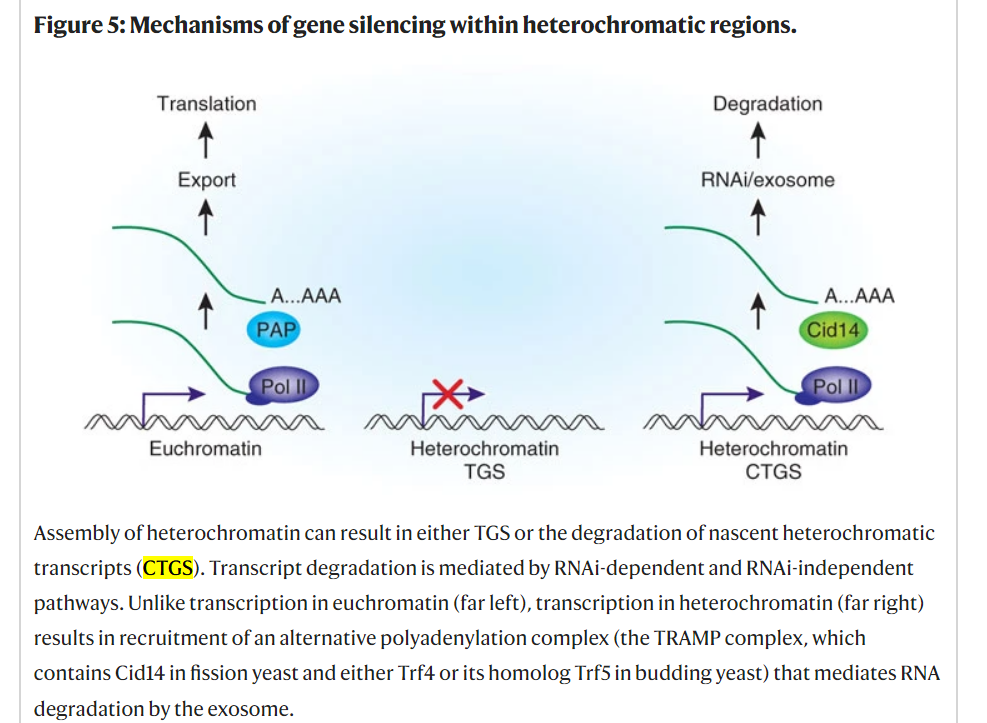
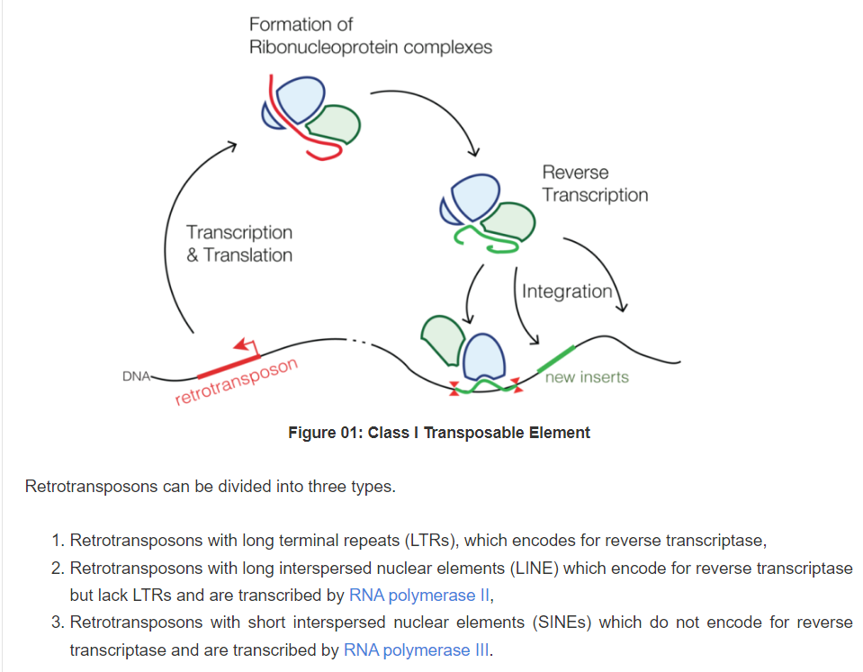
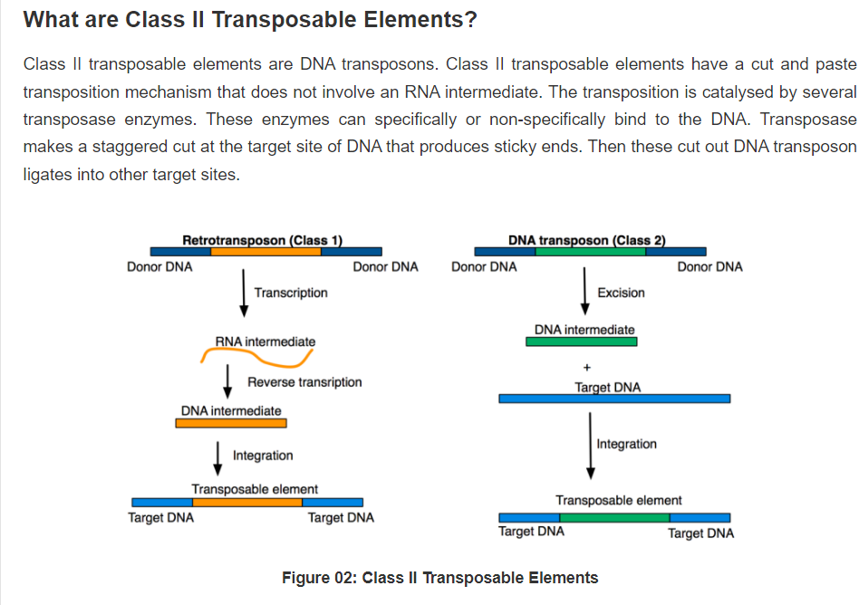
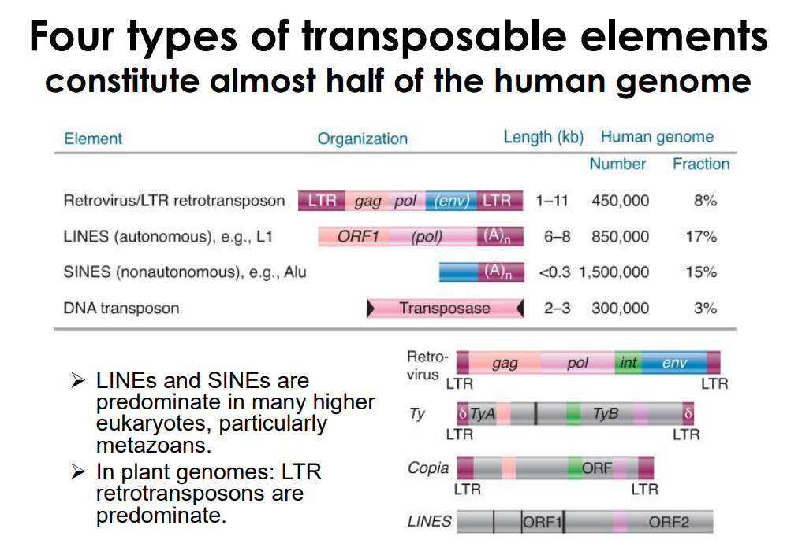
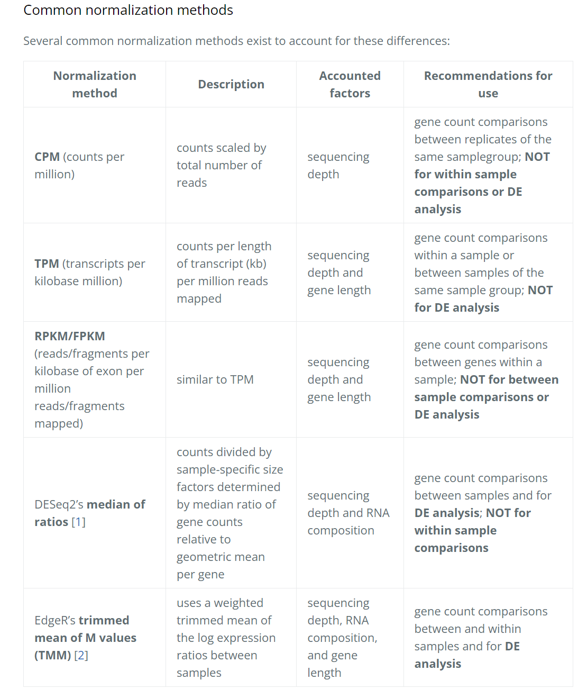

### RNA-induced transcriptional silencing (RITS)
Source: [RNA-induced transcriptional silencing - Wikipedia](https://en.wikipedia.org/wiki/RNA-induced_transcriptional_silencing)

RNA-induced transcriptional silencing (RITS) is a form of RNA interference by which short RNA molecules – such as small interfering RNA (siRNA) – trigger the downregulation of transcription of a particular gene or genomic region. This is usually accomplished by posttranslational modification of histone tails (e.g. methylation of lysine 9 of histone H3) which target the genomic region for heterochromatin formation. The protein complex that binds to siRNAs and interacts with the methylated lysine 9 residue of histones H3 (H3K9me2) is the RITS complex.

### Cotranscriptional gene silencing (CTGS)
Source: [Transcription and RNAi in heterochromatic gene silencing | Nature Structural & Molecular Biology](https://www.nature.com/articles/nsmb1315)

### Class 1 and Class 2 Transposon
Source: [What is the Difference Between Class I and Class II Transposable Elements | Compare the Difference Between Similar Terms](https://www.differencebetween.com/what-is-the-difference-between-class-i-and-class-ii-transposable-elements/)

**What are Class I Transposable Elements?**  
Class I transposable elements are **retrotransposons**. Retrotransposon is a type of genetic component that copies and pastes itself into different genomic locations by converting RNA back into DNA through a process called reverse transcription. This process is catalyzed by the reverse transcriptase enzyme. Retrotransposon normally uses an RNA transposition intermediate. **Class I transposable elements are usually copied in two stages. First, they are transcribed from DNA to RNA. Then the RNA produced is then reverse transcribed to DNA. Later, this copied DNA is inserted back into the genome at a new position.** The characteristics of retrotransposons are very similar to retrovirus such as HIV.

### Long terminal repeat (LTR)
Source: [Long terminal repeat - Wikipedia](https://en.wikipedia.org/wiki/Long_terminal_repeat)

A long terminal repeat (LTR) is **a pair of identical sequences of DNA, several hundred base pairs long, which occur in eukaryotic genomes on either end of a series of genes or pseudogenes that form a retrotransposon or an endogenous retrovirus or a retroviral provirus**. All retroviral genomes are flanked by LTRs, while there are some retrotransposons without LTRs. Typically, an element flanked by a pair of LTRs will encode a reverse transcriptase and an integrase, allowing the element to be copied and inserted at a different location of the genome. Copies of such an LTR-flanked element can often be found hundreds or thousands of times in a genome.

### Introduction to differential expression analysis
Source: [Introduction to DGE](https://hbctraining.github.io/DGE_workshop/lessons/02_DGE_count_normalization.html)

