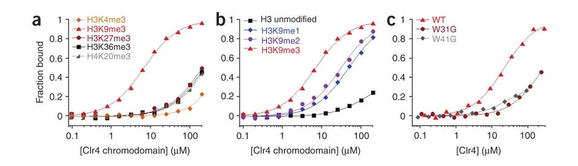

### 1. Why do we care about H3K9me2/3 but not H3K9me?

Source: [Selective recognition of methylated lysine 9 on histone H3 by the HP1 chromo domain](https://www.nature.com/articles/35065138)

#### Introduction about HP1, the component that mediates gene silencing
Heterochromatin protein 1 (HP1) is localized at heterochromatin sites where it mediates gene silencing. The chromo domain of HP1 is necessary for both targeting and transcriptional repression. In the fission yeast *Schizosaccharomyces pombe*, the correct localization of Swi6 (the HP1 equivalent) depends on Clr4, a homologue of the mammalian SUV39H1 histone methylase. Both Clr4 and SUV39H1 methylate specifically lysine 9 of histone H3.

#### The reason why H3K9me2/3
HP1 shows clear selectivity for methylated Lys 9 as it does not bind to methylated Lys 4. **HP1 recognized di-methylated Lys 9 as efficiently as tri-methylated Lys 9, and all mammalian forms of HP1 (α, β and γ) show the same selectivity for methylated Lys 9 (data not shown)**.

*Short answer: Since HP1 mediates gene silencing and cannot recognize mono-methylated Lys 9, H3K9me is thus not a heterochromatin mark.*

### 2. What is the difference between H3K9me2 and H3K9me3?

Source: [Roles of the Clr4 methyltransferase complex in nucleation, spreading and maintenance of heterochromatin | Nature Structural & Molecular Biology](https://www.nature.com/articles/nsmb.1406)

#### Their conclusion
Our analyses further uncover an important functionality of the Clr4 methyltransferase, which is to both write and read the H3K9me chromatin mark. We show that Clr4 binds specifically to H3K9me via its chromodomain. This interaction facilitates the spreading and stable maintenance of heterochromatic structures during cell division, thereby providing a mechanism for the epigenetic inheritance of a defined chromatin state.

#### Part of their results
Clr4 contains a chromodomain motif that is essential for efficient methylation of H3K9 at heterochromatic loci. The Clr4 chromodomain bound specifically to H3K9me but did not bind to H3K4me, H3K27me, H3K36me or H4K20me. **Much stronger binding was observed for trimethylated H3K9 (H3K9me3), which is preferentially enriched throughout the heterochromatic domains in the *S. pombe* genome, as compared to the mono- or dimethylated counterparts.**

*Short answer: No big difference, but the efficiency of recognition by Clr4 is not the same. H3K9me3 has a higher affinity.*

{:target="_blank"}
